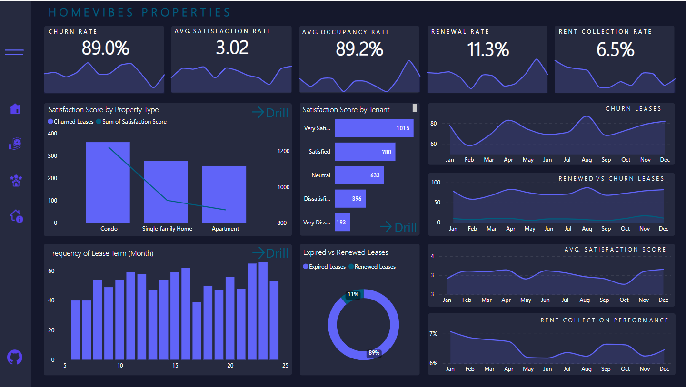
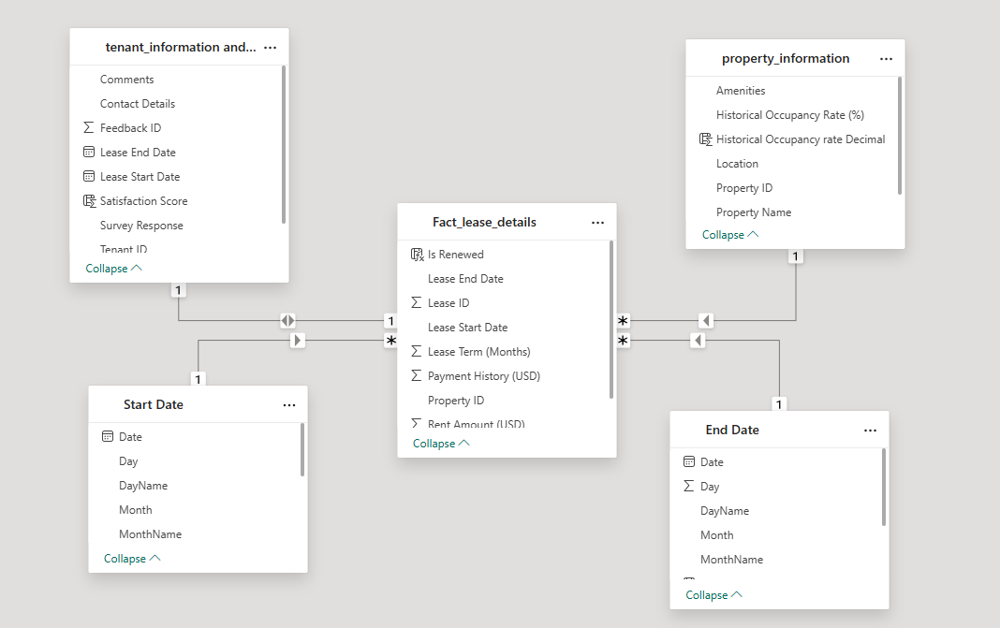

# 🏘️ Tenant Retention Optimization: Building an Interactive Power BI Dashboard for Residential Real Estate Excellence

An end-to-end data analytics solution leveraging Power BI for optimizing tenant retention in the residential real estate industry. This project offers hands-on experience in designing a full-scale data analytics pipeline, from data integration to actionable insights extraction.

-----
* 
-----
## 📖 Table of Contents

  * [📌 Project Overview](https://www.google.com/search?q=%23-project-overview)
  * [🏢 Business Context](https://www.google.com/search?q=%23-business-context)
  * [❗ Business Problem](https://www.google.com/search?q=%23-business-problem)
  * [💡 Project Rationale](https://www.google.com/search?q=%23-project-rationale)
  * [🎯 Project Objectives](https://www.google.com/search?q=%23-project-objectives)
  * [🗃️ Data Description](https://www.google.com/search?q=%23%25EF%25B7%2583%25EF%25B8%258F-data-description)
  * [🛠️ Tech Stack & Project Scope](https://www.google.com/search?q=%23%25EF%25B8%258F-tech-stack--project-scope)
  * [📈 Key Insights Uncovered](https://www.google.com/search?q=%23-key-insights-uncovered)
  * [🧭 Recommendations](https://www.google.com/search?q=%23-recommendations)
  * [🤝 Project Contributor](https://www.google.com/search?q=%23-project-contributor)
  * [📎 Resources](https://www.google.com/search?q=%23-resources)
  * [📄 License](https://www.google.com/search?q=%23-license)

-----

## 📌 Project Overview

This project showcases the development of a comprehensive data analytics solution using Power BI, specifically tailored for the residential real estate sector. The process includes:

  * **Data Integration:** Consolidating data from various sources.
  * **Data Transformation:** Cleaning and preparing raw data for analysis.
  * **Data Analysis and Modeling:** Building a robust data model and performing in-depth analysis.
  * **Dashboard Development and Deployment:** Creating interactive visualizations and deploying the dashboard.
  * **Continuous Improvement:** Designing for iterative enhancements based on ongoing insights.
  * **Reporting and Decision Making:** Translating data into actionable reports for strategic decisions.

-----

## 🏢 Business Context

**HomeVibe Properties** is a distinguished name in the residential real estate sector, managing an extensive portfolio of apartment complexes and single-family rental properties across multiple cities. They are renowned for their commitment to providing exceptional housing solutions and fostering vibrant communities.

In a rapidly evolving real estate market, HomeVibe Properties faces a critical challenge: **tenant retention**. To address this concern and drive sustainable growth, HomeVibe leveraged Power BI to develop an end-to-end solution. This project details the workflow from data collection to an interactive dashboard, aimed at optimizing tenant retention and solidifying HomeVibe's industry leadership.

-----

## ❗ Business Problem

HomeVibe Properties identified several pressing challenges impacting tenant retention:

  * **High Tenant Churn Rates:** Elevated tenant turnover results in increased operational costs and lost revenue.
  * **Limited Tenant Insights:** A lack of actionable insights into tenant satisfaction and their concerns makes it challenging to proactively address issues.
  * **Inefficient Lease Renewals:** The lease renewal process is plagued by inefficiencies, contributing to tenant dissatisfaction and administrative overhead.
  * **Lack of Trend Identification:** Identifying trends and patterns affecting tenant retention is difficult, hindering the development of effective retention strategies.

-----

## 💡 Project Rationale

Optimizing tenant retention is paramount in the real estate and property management industry due to several key benefits:

  * **Enhanced Revenue:** Improved tenant retention directly correlates with increased revenue and profitability as existing tenants renew their leases.
  * **Positive Reputation:** Elevated tenant satisfaction generates positive word-of-mouth, attracting new tenants and enhancing the company's brand image.
  * **Operational Efficiency:** Streamlining lease renewal processes reduces administrative overhead, allowing for better resource allocation.
  * **Competitive Edge:** Data-driven decision-making provides a significant competitive advantage in the highly competitive real estate market.
  * **Sustainability:** A strong focus on tenant retention aligns with sustainable business practices by reducing the environmental impact associated with frequent tenant turnover.

-----

## 🎯 Project Objectives

The primary objectives achieved through this project include:

  * **Design Interactive Dashboard:** Created and implemented an interactive tenant retention dashboard using Power BI.
  * **Data Analysis:** Analyzed historical tenant data to identify factors affecting tenant churn and provided actionable insights.
  * **Lease Renewal Optimization:** Developed strategies to streamline lease renewal processes aimed at increasing tenant retention rates.

-----

## 🗃️ Data Description

The project utilizes **4 interconnected datasets** to provide a holistic view of tenant and property dynamics:

### 1\. Tenant Information

| Column | Description |
| :----- | :---------- |
| Tenant ID | Unique identifier for each tenant. |
| Tenant Name | Full name of the tenant. |
| Contact Details | Email or phone contact information. |
| Lease Start Date | The date when the tenant's lease agreement started. |
| Lease End Date | The date when the tenant's lease agreement is scheduled to end. |

### 2\. Lease Details

| Column | Description |
| :----- | :---------- |
| Lease ID | Unique identifier for each lease. |
| Lease Start Date | The date when the lease agreement started. |
| Lease End Date | The date when the lease agreement is scheduled to end. |
| Lease Term (Months) | The duration of the lease in months. |
| Rent Amount | The monthly rent for the lease (e.g., USD). |
| Payment History | The total amount paid for the lease (e.g., USD). |

### 3\. Tenant Feedback

| Column | Description |
| :----- | :---------- |
| Feedback ID | Unique identifier for each feedback entry. |
| Tenant ID | Identifies the tenant associated with the feedback (Linked to Tenant Information). |
| Survey Response | Text responses to survey questions, indicating tenant satisfaction. |
| Comments | Open-ended comments provided by tenants, offering additional feedback or details. |

### 4\. Property Information

| Column | Description |
| :----- | :---------- |
| Property ID | Unique identifier for each property. |
| Property Name | The name or title of the property. |
| Location | The location of the property (Address or coordinates). |
| Property Type | The type of property (e.g., Apartment, Single-family home). |
| Amenities | A list of amenities offered at the property. |
| Historical Occupancy Rate (%) | The historical occupancy rate of the property, expressed as a percentage. |

#### Data Model (ERD)
 *  

-----

## 🛠️ Tech Stack & Project Scope

The core of this project is built upon **Microsoft Power BI**, utilized across various stages of the data analytics pipeline:

**Component** | **Tool** | **Application**
| :---------------- | :------------- | :----------------------------------------------- |
| **ETL** | Power Query | Data extraction, cleaning, and transformation. |
| **Data Modeling** | Power BI Desktop | Building logical relationships between datasets. |
| **Visualization** | Power BI Desktop | Creating interactive charts and graphs. |
| **Deployment** | Power BI Service | Publishing dashboards for wider access and insights. |
| **Cloud Integration** | Power BI Service | Seamless integration for real-time reporting. |

### Project Scope:

  * **Exploratory Data Analysis (EDA):** In-depth exploration of data to understand its characteristics and discover patterns.
  * **Data Transformation:** Comprehensive data preparation, including transforming, encoding, or normalizing data.
  * **Data Analysis:** Analyzing data to understand patterns and generate insights that will be visualized.
  * **Data Visualization:** Creating visual representations to communicate insights effectively.
  * **Interpretation and Insight Generation:** Extracting meaningful insights and interpreting the results.
  * **Reporting:** Creating and sharing professional dashboards for strategic decisions.

### Success Metrics

The dashboard's impact is measured against key performance indicators (KPIs):

| KPI | Baseline | Target |
| :-- | :------- | :----- |
| Annual Churn | 76.6% | ≤30% |
| Renewal Rate | 23.4% | ≥75% |
| Satisfaction | 3.01 | 4.5 |

-----

## 📈 Key Insights Uncovered

The interactive dashboard reveals critical insights into tenant behavior and property performance, enabling HomeVibe Properties to make informed decisions:

  * **Seasonal Churn Trends:** The line chart of churn rate by month reveals seasonal patterns or specific times of the year when churn rates spike, indicating that April and August are the two months where targeted retention efforts could be most beneficial.
  * **Lease Term Preferences and Their Impact on Retention:** The frequency distribution of lease terms highlights tenant preferences, showing whether shorter or longer leases correlate with higher retention rates, suggesting adjustments to lease offerings.
  * **Direct Correlation Between Tenant Satisfaction and Retention:** Analysis from the bar chart showing satisfaction scores and the combo chart correlating churn status with satisfaction scores by property type provide concrete evidence that higher satisfaction levels are crucial for reducing churn rates.
  * **Financial Efficiency and Its Role in Overall Property Performance:** Rent collection performance insights highlight operational efficiencies or issues affecting the company’s financial health and its ability to invest in property improvements and tenant services.
  * **Effectiveness of Renewal Strategies Over Time:** The comparison of renewed versus expired leases over time can indicate the success of recent retention strategies or highlight the need for new approaches.

-----

## 🧭 Recommendations

Based on the insights derived from the dashboard, the following strategic recommendations are put forth for HomeVibe Properties:

  * **Implement Targeted Retention Programs:** Develop and deploy specialized retention programs during identified high-risk periods (e.g., April and August). These programs could include personalized communication, special offers, and community-building events to actively engage tenants and encourage renewals.
  * **Adjust Lease Terms to Meet Tenant Preferences:** If certain lease lengths correlate with higher retention, consider offering more flexible or preferred lease terms to both new and renewing tenants to encourage longer stays.
  * **Enhance Tenant Satisfaction:** Prioritize improvements in areas that directly impact tenant satisfaction, as indicated by feedback survey responses. This may involve investing in property amenities, improving maintenance responsiveness, or enhancing community-building initiatives.
  * **Optimize Financial Operations:** Address any identified inefficiencies in rent collection processes to improve financial stability. Consider implementing technology solutions for easier payment processes or offering incentives for on-time payments to further streamline operations.

-----

## 📎 Resources

  
  * [Live Dashboard (Power BI Service)](https://www.google.com/search?q=%23) 
  * [Raw Datasets (CSV)](https://www.google.com/search?q=%23) 

-----

## 📄 License

This project is licensed under the MIT License. See the `LICENSE` file for details.

-----
